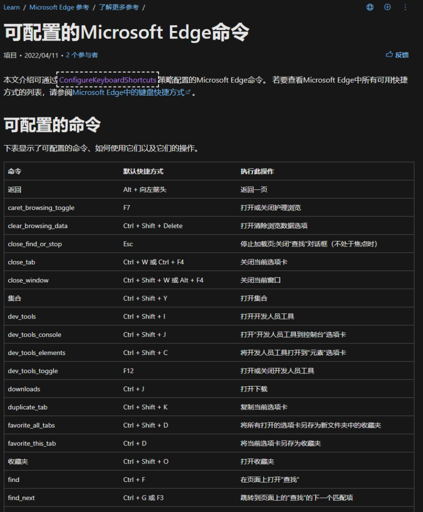
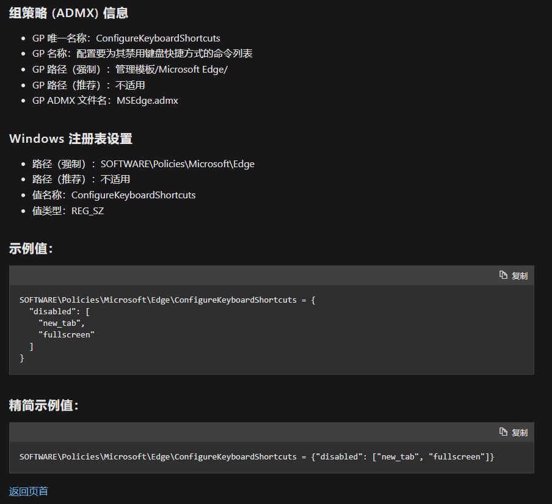
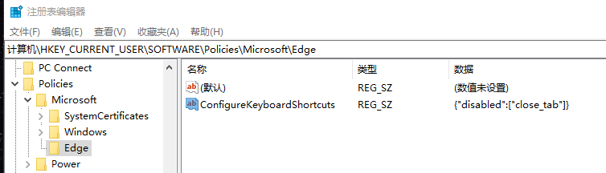

## 禁用edge浏览器某些快捷键

最近在玩PVE，因为经常需要用终端修改配置文件，但是浏览器的快捷键会和一些代码编辑器的快捷键冲突，比如nano的Ctrl+W搜索，浏览器则是关闭当前页面，一个不小心就会白干一场，非常不方便。

千度了一下也没找到合适的禁用快捷键的方法。

想起微软在文档这方面写的还是比较全面的，就直接去微软的文档中心去找。果然有：[可配置的Microsoft Edge命令 | Microsoft Learn](https://learn.microsoft.com/zh-cn/deployedge/edge-learnmore-configurable-edge-commands)



根据文章`https://learn.microsoft.com/zh-cn/deployedge/microsoft-edge-policies#configurekeyboardshortcuts`中的策略配置说明，修改注册表



Windows 注册表设置
路径（强制）：SOFTWARE\Policies\Microsoft\Edge
路径（推荐）：不适用
值名称：ConfigureKeyboardShortcuts
值类型：REG_SZ

并且给了个例子：

```
SOFTWARE\Policies\Microsoft\Edge\ConfigureKeyboardShortcuts = {"disabled": ["new_tab", "fullscreen"]}
```

具体意思就是在注册表编辑器里打开路径

```
计算机\HKEY_CURRENT_USER\SOFTWARE\Policies\Microsoft\Edge
```

这个路径默认情况下可能是没有Edge的，需要自己创建。

然后在这里新建一个字符串值，名字为`ConfigureKeyboardShortcuts`

编辑这个值，的数值数据，在里面写上json数据`{"disabled": ["new_tab", "fullscreen"]}`

也就是禁用对应的创建新标签页和全屏的快捷键。其他更多快捷键在一开始的文章里也有说明，对着把自己想要禁用的快捷键功能名填到这个json数组里，然后重启浏览器就可以了。

比如我想要禁用关闭标签页的功能，根据官方文档说明这个功能的值是close_tab，那么在`ConfigureKeyboardShortcuts`的值里写`{"disabled":["close_tab"]}`然后重启浏览器即可。

